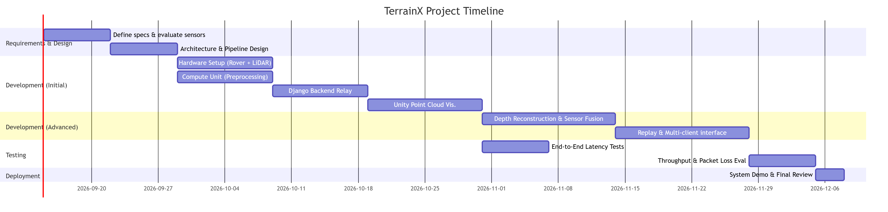
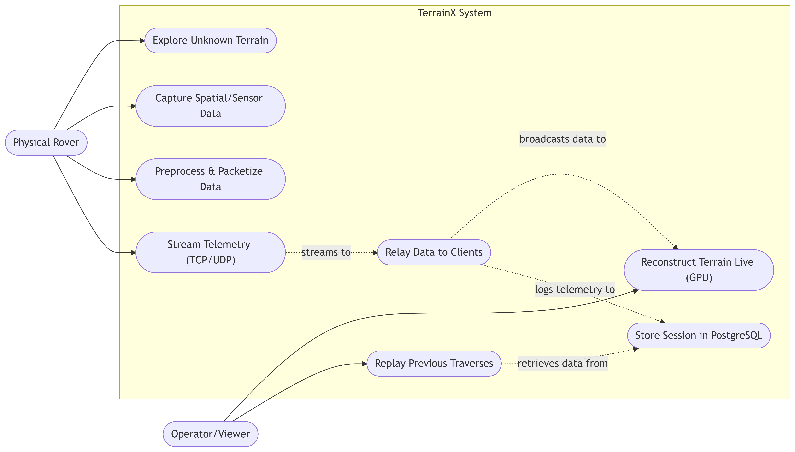
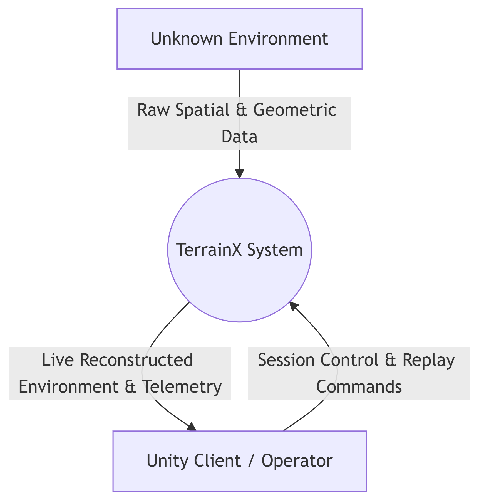
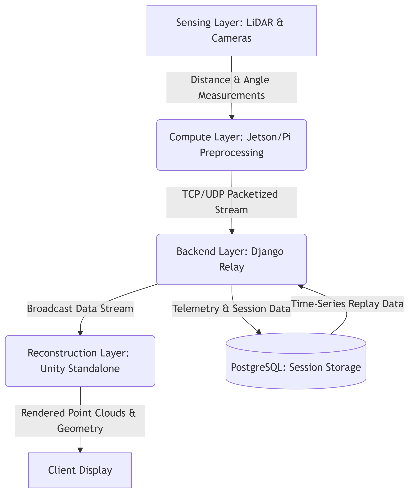

# TerrainX: Real-Time Rover-Based Terrain Sensing and Reconstruction System

## Team
- Apoorv Singhal, CSED — Unity, OpenGL, C#, GPU rendering  
- Yash Aggarwal, CSED — Backend systems, networking, Django  
- Divit Malhotra, CSED — Embedded systems, robotics, hardware integration  

---

## Origin

Inspired by ISRO's **Bharatiya Antariksh Hackathon (BAH) 2026**, particularly challenges involving terrain analysis and planetary exploration.

TerrainX evolves beyond static simulations into a **live sensing and reconstruction system**, where a rover actively explores and digitizes unknown environments in real time.

---

## Problem Statement

Existing rover systems typically fall into two categories:

- **Simulation-based systems** relying on preloaded terrain  
- **Physical prototypes** with limited sensing and no real-time visualization  

There is no accessible system that:

- explores **unknown terrain in the real world**
- captures spatial data in real time  
- reconstructs the environment dynamically  
- enables remote visualization and replay  

---

## Objective

To build a system where:

- A rover navigates **unknown terrain**  
- Sensors capture spatial and environmental data  
- Data is streamed in real time via a backend  
- A simulation reconstructs the terrain live  
- Traverses are stored and replayable  

---

## Project Description

TerrainX is a **real-time terrain sensing and reconstruction platform** powered by a physical rover.

- A rover equipped with **LiDAR and/or depth sensors** explores unknown terrain  
- A **companion compute unit** processes sensor data  
- Data is streamed using **TCP/UDP networking**  
- A **Django backend** relays and logs the data  
- A **Unity standalone application** reconstructs and visualizes the environment in real time  

The system transforms physical exploration into a **live, digital reconstruction pipeline**.

---

## USP

**“A rover that discovers unknown terrain and reconstructs it live in a simulation.”**

Key differentiators:

- **Active sensing** — no preloaded terrain  
- **Hardware-driven reconstruction** — real-world data, not simulation  
- **Low-latency pipeline** — TCP/UDP communication  
- **GPU-accelerated visualization** — real-time rendering in Unity  

---

## System Architecture

``` id="terrainx-arch"
LiDAR / Depth Camera
        ↓
Onboard Compute Unit (Raspberry Pi / Jetson)
        ↓
TCP / UDP (WiFi)
        ↓
Django Backend (Relay + Logging)
        ↓
TCP / UDP
        ↓
Unity Standalone Simulation (Reconstruction)
        ↓
PostgreSQL (session storage)
```

---

## Gantt Chart



---

## Use Case Diagram



---

## Data Flow Diagrams

### Level 0



### Level 1



---

## System Components

### 1. Sensing Layer

Primary sensors:

- **2D LiDAR (recommended baseline)**
  - Distance + angle measurements  
  - Enables real-time point cloud mapping  

Optional sensors:

- **Depth camera** → richer spatial reconstruction  
- **360 camera** → visual context (non-geometric)  

---

### 2. Compute Layer

A companion system (Raspberry Pi / Jetson Nano):

Responsibilities:

- Interface with sensors  
- Preprocess and filter data  
- Convert to structured format  
- Timestamp and packetize  
- Stream over TCP/UDP  

This layer is essential due to limitations of microcontrollers.

---

### 3. Communication Layer

Custom networking:

- **UDP**
  - High-frequency telemetry streaming  
  - Low latency  
  - Accepts packet loss  

- **TCP**
  - Reliable communication  
  - Session control and replay  

---

### 4. Backend Layer (Django)

Acts as a **relay and persistence layer**.

Responsibilities:

- Receive incoming data streams  
- Broadcast to Unity clients  
- Store telemetry for replay  
- Manage sessions  

Note: No heavy data processing is performed here.

---

### 5. Digital Reconstruction Layer (Unity Standalone)

A GPU-accelerated application responsible for:

- Receiving live sensor data  
- Rendering:
  - LiDAR point clouds  
  - Depth-based geometry  
- Updating environment dynamically  
- Supporting replay and visualization  

---

## Data Pipeline

``` id="terrainx-pipeline"
Sensor → Preprocessing → Packetization → TCP/UDP → Backend Relay → Unity Reconstruction
```

---

## Backend Complexity (Interview Framing)

TerrainX introduces challenges in:

1. Handling high-frequency UDP streams  
2. Managing packet loss and ordering  
3. Broadcasting real-time data to clients  
4. Storing large time-series datasets  
5. Supporting replay functionality  

---

## Evaluation Criteria

### Primary Metric

- **End-to-end latency**
  - Target: ≤ 300–500 ms  

### Secondary Metrics

- Packet loss rate  
- Reconstruction accuracy  
- Frame consistency  
- Throughput under load  
- System stability  

---

## Deliverables

### Initial

- Rover with LiDAR sensor  
- Compute unit streaming structured data  
- Backend relay server  
- Unity point cloud visualization  

### Advanced

- Depth-based reconstruction  
- Multi-client viewing  
- Replay interface  
- Sensor fusion  
- Improved spatial accuracy  

---

## Risks & Mitigations

| Risk | Mitigation |
|------|------------|
| High data volume | downsampling, compression |
| UDP packet loss | interpolation, smoothing |
| Processing bottlenecks | offload to compute unit |
| Reconstruction complexity | start with LiDAR |
| Hardware limitations | modular system design |

---

## Summary

TerrainX is a **real-time, hardware-driven terrain reconstruction system** where:

- A rover **explores unknown environments**  
- Sensors capture **live spatial data**  
- A backend relays and logs the data  
- A Unity simulation **reconstructs the terrain in real time**  

It bridges the gap between **physical exploration and digital visualization**, enabling live understanding of unknown environments.